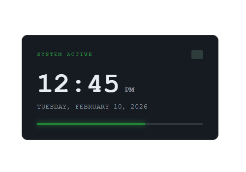

# 🟢 Digital Widget

A high-performance, developer-centric Digital widget. This component features a professional emerald-accented dark theme, kinetic "pulse" animations for status indicators, and a clean, modular code architecture.

## 👀 Preview

 

## 🚀 Features
* **Kinetic UI Transitions:** Smooth `cubic-bezier` transitions for hover lifting and shadow depth adjustments.
* **Status Orchestration:** Custom CSS keyframes create a "pulse" effect on the system chip icon to simulate live activity.
* **Emerald & Slate Palette:** Engineered for low eye-strain and high professional contrast 

## 🛠️ Files
* `index.html` - Semantic structure with designated sections for header, content, and metrics.
* `style.css` - Comprehensive styling including design tokens, layout resets, and animation logic.

## 🎨 Design Assets & Technologies
* **Framework:** Pure HTML5 & CSS3
* **Typography:** Monospace Stack (`Courier New`, `monospace`)
* **Color Palette:**
    * **Background:** `#0d1117` (Deep Slate)
    * **Primary Accent:** `#238636` (Emerald Green)
    * **Text Primary:** `#e6edf3` (Cloud White)
* **Logic:** CSS Transitions, Keyframe Animations, Flexbox Layout.

## 💻 How to Use
1.  Clone the repository to your local machine.
2.  Ensure `index.html` and `style.css` are in the same root directory.
3.  Open `index.html` in any modern browser to view the system widget in action.