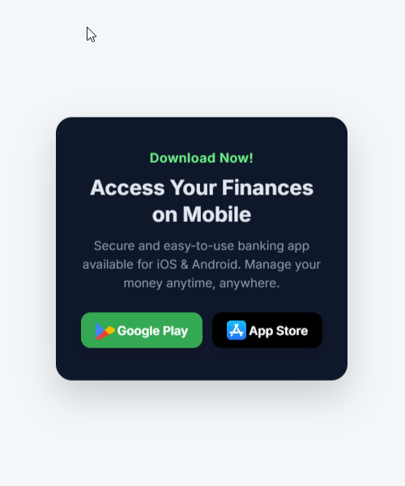
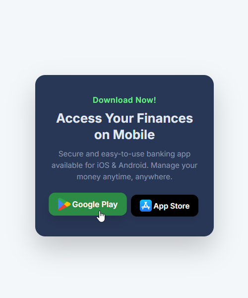

# App Download Card

A professional and clean call-to-action card designed to drive mobile app installs for fintech platforms.

## 👀Preview 

| Static State | Hover State (Effect) |
| :--- | :--- |
|  |  |

## 🚀 Features
* **Brand Recognition:** Official SVG icons for Google Play and Apple App Store.
* **Modern Typography:** Uses the 'Inter' font family for a premium, tech-forward feel.
* **Conversion Focused:** High-contrast headings and clear action buttons.
* **Semantic HTML:** Clean, SEO-friendly structure for better accessibility.

## 🛠️ Files
* `index.html` - The structure of the download section.
* `style.css` - The layout, button styling, and typography rules.

## 🎨 Design Assets
* **Typography:** Inter (Weights: 400, 600, 700)
* **Google Play Icon:** Official 2022 Brand Identity
* **App Store Icon:** Standard iOS System Branding

