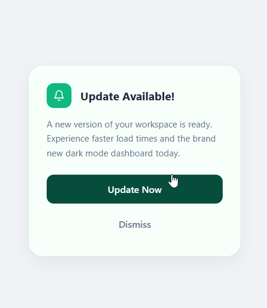

# Notification Message Card

A sleek, minimalist notification component designed for modern web applications. This project features a high-impact "Emerald & Slate" design with interactive feedback.

## 👀 Preview 

 

## 🚀 Features
* **Premium Aesthetic:** Designed with a 24px "Squircle" border radius and a soft mint background.
* **Interactive UI:** Features smooth hover states including a subtle vertical lift on the primary action button.
* **Clean Iconography:** Includes a lightweight, inline SVG bell icon for instant visual context.
* **Responsive & Modular:** Built with Flexbox to ensure perfect centering and easy integration into larger projects.

## 🛠️ Files
* `index.html` - Semantic HTML5 structure with optimized button hierarchy.
* `style.css` - Custom CSS featuring a refined typography scale and Emerald Green accents.

## 🎨 Design Assets
* **Typography:** Segoe UI / System Sans-Serif
* **Color Palette:** * Primary Emerald: `#10b981` (Icon & Accents)
    * Dark Forest: `#064e3b` (Primary Button)
    * Slate Grey: `#64748b` (Secondary Text)
    * Soft Mint: `#f7fffb` (Card Background)
* **Interactive Effects:** * `translateY(-1px)` hover lift for the main CTA.
    * Smooth color transitions for secondary actions.

## ⚙️ How to Use
Simply clone the repository and open `index.html` in any modern web browser.