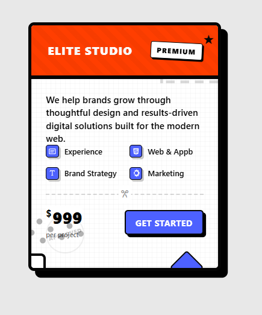

# Pricing Card Component

A modern, bold, and interactive **Pricing Card UI** built using **pure HTML and CSS**.  
This component is designed with attention to micro-interactions, hover effects, layered patterns, and a playful yet professional visual style.

Perfect for:
- Landing pages
- Agency or portfolio websites
- UI practice and inspiration

---

## 👀 Preview (Before & After Hover)

| Static State | Hover State (Effect) |
| :--- | :--- |
|  |  |

---

## 🚀 Features

- Pure HTML & CSS (No frameworks, No JavaScript)
- CSS Variables for easy theme customization
- Advanced hover & active state animations
- Decorative SVG patterns and accents
- Clean, scalable, and reusable structure
- Pixel-perfect shadows and borders

---

## 🛠️ Built With

- **HTML5** – Semantic markup  
- **CSS3**
  - CSS Variables
  - Flexbox & Grid
  - Pseudo-elements
  - Transitions & transforms
  - SVG styling

---

