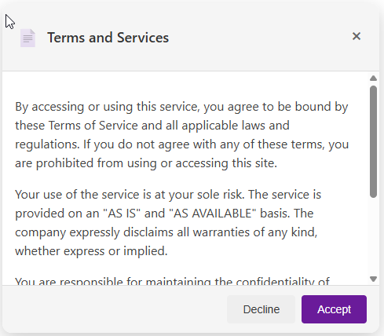

# Terms and Services Modal Card

A lightweight, responsive modal dialog component that displays terms or other
lengthy information. Designed with clean, modern UI and interactive button
state feedback.

## 👀 Preview

## 🚀 Features

* **Modal Layout:** Central card overlay with subtle backdrop and rounded
  corners.
* **Scrollable Content:** Fixed-height body area with vertical scrolling for
  long text.
* **Action Buttons:** `Decline` and `Accept` controls with hover lift effects.
* **Accessible Close:** Close icon in header and accessible `aria-label`.
* **Minimal Dependencies:** Pure HTML/CSS—no scripts or frameworks required.
* **Responsive Design:** Mobile-friendly layout that adapts seamlessly across all screen sizes and devices.

## 🛠️ Files

* `index.html` – semantic structure of the modal dialog.
* `style.css` – layout rules, color palette, and hover/transition effects.

## 🎨 Design Tokens (Colors)

* **Background:** `#FFFFFF` (white)
* **Card Shadow:** `rgba(0,0,0,0.2)`
* **Header/Foot Background:** `#F5F5F5`
* **Primary Button:** `#6A1B9A` (deep purple)
* **Secondary Button:** `#EEEEEE` (light grey)
* **Text:** `#333333` / `#444444`

## 📖 How to Use

1. Download or clone the `terms-card` folder into your project.
2. Ensure `index.html` links to `style.css` (as it does by default).
3. Open `index.html` in a browser to view the modal; it will appear centered
    on page load.
4. Replace the placeholder text inside `.modal-content` with your actual
    terms or other content.
5. Customize colors or spacing by editing `style.css` or override the styles
    in your own stylesheet.
